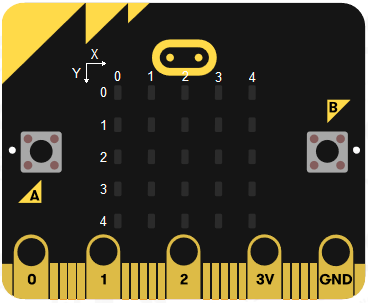

¡Claro que sí\! Vamos a unificar todo lo que hemos aprendido: la estructura pedagógica para chicos de 12-13 años, el uso de **rutas relativas** para tus imágenes (`imagenes/`) y el formato limpio de Markdown.

Aquí tienes la versión definitiva para tu archivo `03_leds_parpadeantes.md`:

-----

# 💡 Luces Parpadeantes: Mi primer Faro Digital

## El reto de hoy @unplugged

¡Hola, inventor/a\! En este tutorial vamos a tomar el control total de la **Matriz LED** de tu Micro:bit. Aprenderemos a encender puntos específicos y a crear una animación de parpadeo usando el tiempo a nuestro favor.

### 🎯 Objetivo de la lección

  * Entender el sistema de **coordenadas X e Y**.
  * Aprender a usar las **pausas** para crear animaciones.
  * Programar un bucle infinito con el bloque **"Para siempre"**.

### 🛠️ Requisitos
* Una tarjeta **BBC Micro:bit**.
* Un cable **Micro-USB**.
* Ordenador con acceso a [MakeCode](https://makecode.microbit.org/).


### 🧠 Concepto Clave: El Mapa de la Pantalla

La pantalla de tu Micro:bit tiene 25 LEDs organizados en una cuadrícula de **5x5**. Para encender uno, necesitamos darle su "dirección" exacta:

  * **Eje X (Horizontal):** Va del **0** (izquierda) al **4** (derecha).
  * **Eje Y (Vertical):** Va del **0** (arriba) al **4** (abajo).
  * **Punto (0,0):** Es el LED de la esquina superior izquierda.

Antes de programar, mira esta imagen. La pantalla de la Micro:bit es como un mapa de piratas con ejes X e Y:




-----

## 🚀 Paso 1: Encender el primer LED

Vamos a encender el LED de la esquina superior izquierda para comprobar que todo funciona.

1.  Busca el bloque `||led:graficar x 0 y 0||` dentro de la categoría **LED**.
2.  Arrástralo dentro del bloque azul `||basic:para siempre||`.

<!-- end list -->

```blocks
basic.forever(() => {
    led.plot(0, 0)
})
```

*¿Ves ese punto rojo en el simulador? ¡Ya estás controlando el hardware\!*

-----

## ⏱️ Paso 2: Crear el efecto de parpadeo

Para que un LED parpadee, la Micro:bit debe seguir cuatro órdenes en bucle: **Encender -\> Esperar -\> Apagar -\> Esperar**.

1.  Añade un bloque `||basic:pausa (ms) 1000||` (1000 ms es igual a 1 segundo).
2.  Justo debajo, coloca el bloque `||led:ocultar x 0 y 0||`.
3.  **¡Muy importante\!** Añade otra **pausa** de 1000 ms al final. Si no la pones, el código volverá al principio tan rápido que no verás el LED apagado.

<!-- end list -->

```blocks
basic.forever(() => {
    led.plot(0, 0)
    basic.pause(1000)
    led.unplot(0, 0)
    basic.pause(1000)
})
```

-----

## 🎭 Desafío 1: El Robot que guiña un ojo

Ahora que sabes usar las coordenadas, vamos a dibujar algo más divertido.

**Tu misión:** Haz que la Micro:bit muestre dos "ojos" parpadeando.

1.  Los ojos deben estar en las coordenadas `(1, 1)` y `(3, 1)`.
2.  Haz que ambos se enciendan a la vez, esperen 1 segundo, y se apaguen a la vez.

<!-- end list -->

```blocks
basic.forever(() => {
    led.plot(1, 1)
    led.plot(3, 1)
    basic.pause(1000)
    led.unplot(1, 1)
    led.unplot(3, 1)
    basic.pause(1000)
})
```

-----

## 🔥 Desafío Final: ¡La Gran Sonrisa!

¿Eres capaz de hacer que una cara sonriente completa aparezca y desaparezca cada medio segundo?

**Pistas para expertos:**

  * Usa los puntos `(0, 3)`, `(4, 3)`, `(1, 4)`, `(2, 4)` y `(3, 4)` para la boca.
  * Cambia las pausas de `1000 ms` a `500 ms` para que parpadee más rápido.

-----
