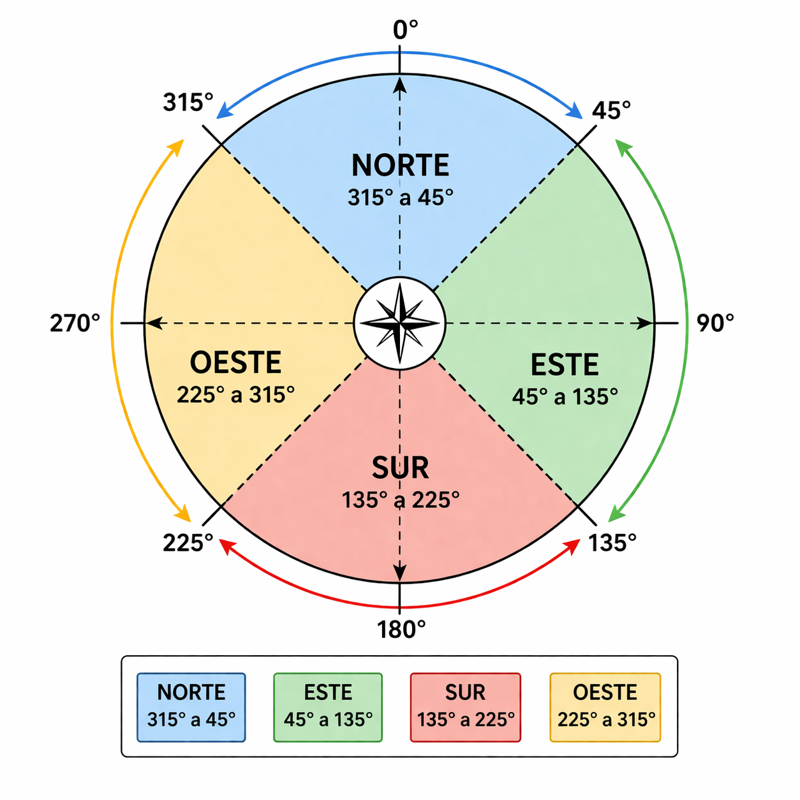

# Brújula Digital: Orientación en 360° 🧭

## El reto de hoy @unplugged

¡Hola, exploradores/as! Hoy vamos a convertir nuestra Micro:bit en una **brújula de alta tecnología**. No solo sabrá dónde está el Norte, sino que nos lo dirá con letras en su pantalla. Para lograrlo, aprenderemos cómo se dividen los grados de un círculo y cómo la placa "siente" el magnetismo de la Tierra.

### 🎯 Objetivos de la lección

* Entender el funcionamiento del **Magnetómetro**.
* Aprender a **calibrar** un sensor electrónico.
* Usar **rangos numéricos** (operadores "y") para detectar direcciones.

### 🛠️ Requisitos

* Una tarjeta **Micro:bit**.
* **¡Importante!** Al usar la brújula por primera vez, la placa te pedirá "dibujar un círculo" o "llenar la pantalla de puntos" para calibrarse. ¡Es como un pequeño juego!

---

### 🧠 Concepto Clave: Los Grados del Círculo

La Micro:bit nos da la dirección en grados, desde **0** hasta **359**:
* **0° o 360°:** Norte (N)
* **90°:** Este (E)
* **180°:** Sur (S)
* **270°:** Oeste (O)

---

## 🚀 Paso 1: Creando la "aguja" invisible

Necesitamos guardar la dirección que detecta la placa en una variable para poder preguntar por ella.

1.  Crea una variable llamada `||variables:dirección||`.
2.  Dentro del bloque `||basic:para siempre||`, fija esa variable al valor de `||input:dirección de la brújula (°)||`.

```blocks
let dirección = 0
basic.forever(function () {
    dirección = input.compassHeading()
})
```

---

## 🚀 Paso 2: ¿Dónde está el Norte?

El Norte es un poco especial porque está justo en el **0**. Para que nuestra brújula sea precisa, diremos que si estamos cerca del 0 (entre 315° y 45°), ¡estamos mirando al Norte!

1.  Usa un bloque `||logic:si / si no||`.
2.  En la condición, usa el operador lógico `||logic: o ||`.
3.  Pregunta: `||logic:si dirección < 45||` **O** `||logic:dirección > 315||`.
4.  Si es verdad, muestra la letra **"N"**.



---

## 🚀 Paso 3: Completando el resto de puntos

Ahora añadiremos el resto de puntos cardinales usando `||logic:si no, si||`.

1.  Si la dirección es menor de **135**, muestra la **"E"** (Este).
2.  Si la dirección es menor de **225**, muestra la **"S"** (Sur).
3.  Si la dirección es menor de **315**, muestra la **"O"** (Oeste).

```blocks
basic.forever(function () {
    let dirección = input.compassHeading()
    if (dirección < 45 || dirección > 315) {
        basic.showString("N")
    } else if (dirección < 135) {
        basic.showString("E")
    } else if (dirección < 225) {
        basic.showString("S")
    } else {
        basic.showString("O")
    }
})
```

---

## 🕵️ Prueba de campo: ¡Calibración!

Cuando descargues el programa, verás un mensaje que dice **"TILT TO FILL SCREEN"**.
1.  Gira y mueve la Micro:bit en todas direcciones hasta que todos los LEDs se enciendan.
2.  Una vez terminado, aparecerá una carita feliz y empezará a funcionar tu brújula.
3.  Compara tu Micro:bit con una brújula real o la de un móvil. ¿Apuntan al mismo sitio?

---

## 🧪 Desafío: ¡Rumbo exacto!

**Misión:** A veces, un explorador necesita saber el grado exacto, no solo la letra.

1.  Haz que, al pulsar el **Botón A**, la Micro:bit nos muestre el **número exacto** de grados en ese momento.
2.  ¿Puedes añadir un sonido corto cada vez que la placa apunte exactamente al Norte (0°)?

**Pregunta para pensar:** ¿Qué crees que pasará si acercas un imán o unas tijeras de metal a la Micro:bit mientras usas la brújula? ¡Pruébalo!

---

## 📥 Envía el programa

¡Ya eres un experto en orientación! Dale a **Descargar** y sal al patio a probar tu brújula. ¡Asegúrate de estar lejos de ordenadores o estructuras metálicas grandes para que no interfieran!

---